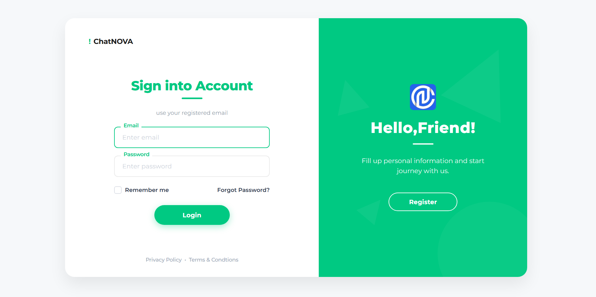
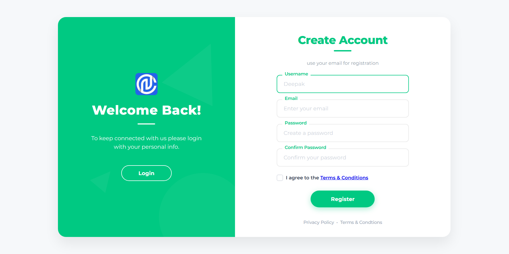
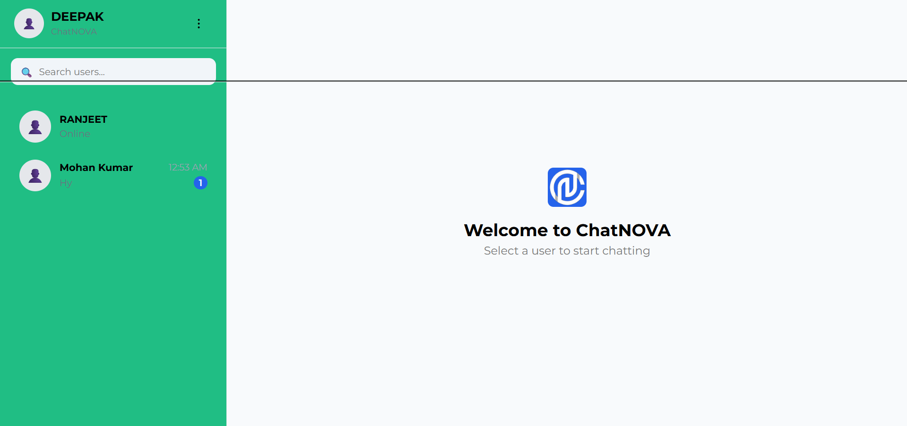
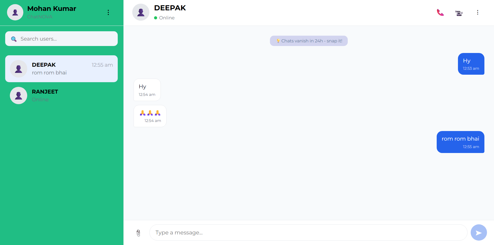

# 💬 ChatNOVA — Real-Time Chat Application

<p align="center">
  <strong>ChatNOVA is a full-stack real-time communication platform built with React, Node.js, Express, MongoDB and Socket.IO, featuring real-time messaging, user discovery, authentication and WebRTC-based communication..</strong>
</p>

<p align="center">
  <a href="https://chatnova-seven.vercel.app/">🚀 Live Demo</a>
  •
  <a href="https://github.com/deepak-1252-git/Real_time_chat_app_ChatNOVA">📂 Source Code</a>
</p>

---

## 📌 About The Project

The project focuses on building a practical real-world communication system with a separate **frontend and backend architecture**, real-time message delivery, user interaction and a responsive chat interface.

This project was developed to strengthen my understanding of:

* Full-stack web development
* Client–server architecture
* Real-time communication
* API integration
* Authentication and user management
* Database operations
* Responsive UI development
* Deployment and production workflows

---

## ✨ Features

### 💬 Real-Time Messaging

* Instant message delivery between users
* Real-time communication without manually refreshing the page
* Smooth chat experience

### 👤 User System

* User registration and login
* User-based chat experience
* User-specific conversations

### 📨 Chat Experience

* Send and receive messages in real time
* Conversation-based messaging
* Dynamic chat interface
* Message state handling

### 🎨 Responsive Interface

* Clean and modern UI
* Responsive layout
* Works across different screen sizes
* Interactive chat components

### ⚡ Full-Stack Architecture

* Separate frontend and backend
* API-based communication
* Backend handles application logic and data operations
* Frontend communicates with backend services

### 🌐 Deployment

* Frontend deployed for public access
* Production-oriented project structure
* Environment-based configuration

---

## 🛠️ Tech Stack

### Frontend

* React.js — Component-based UI development
* JavaScript (ES6+) — Application logic
* CSS3 — Responsive and modern styling
* Vite — Frontend development and build tooling
* Socket.IO Client — Real-time communication
* React Hooks — State and lifecycle management

### Backend

*  Node.js — Server-side JavaScript runtime
* Express.js — REST API and server framework
* Socket.IO — Real-time, bidirectional communication
* JavaScript (ES6+) — Backend application logic

### Database

* MongoDB — NoSQL database for users, conversations and messages
* Mongoose — MongoDB object modeling and database interaction

### Authentication & Security

* JWT (JSON Web Token) — User authentication
* Middleware-based authentication — Protected API routes
* Environment Variables — Secure configuration management

### Tools & Services

* Git & GitHub — Version control
* npm — Package management
* Vercel — Frontend deployment
* REST APIs — Frontend ↔ Backend communication
* Socket.IO — Real-time event communication
* Render

---

## 🏗️ Project Architecture

```text
ChatNOVA/
│
├── backend/
│   │
│   ├── config/
│   │   └── Database configuration
│   │
│   ├── controllers/
│   │   └── Application & API business logic
│   │
│   ├── middleware/
│   │   └── Authentication / request middleware
│   │
│   ├── models/
│   │   └── MongoDB / Mongoose models
│   │
│   ├── routes/
│   │   └── API routes
│   │
│   ├── server.js
│   ├── package.json
│   └── .env
│
├── frontend/
│   │
│   ├── public/
│   │
│   ├── src/
│   │   │
│   │   ├── components/
│   │   │   └── chat/
│   │   │       ├── Calls/
│   │   │       ├── ChatHeader.jsx
│   │   │       ├── ChatWindow.jsx
│   │   │       ├── EmptyChat.jsx
│   │   │       ├── MessageBubble.jsx
│   │   │       ├── MessageInput.jsx
│   │   │       ├── MessageList.jsx
│   │   │       ├── ProfileMenu.jsx
│   │   │       ├── Sidebar.jsx
│   │   │       ├── UserItem.jsx
│   │   │       ├── UserList.jsx
│   │   │       └── UserSearch.jsx
│   │   │
│   │   ├── hooks/
│   │   │   ├── useChatSocket.js
│   │   │   ├── useMessages.js
│   │   │   ├── useUserSearch.js
│   │   │   └── useWebRTC.js
│   │   │
│   │   ├── pages/
│   │   │   ├── AppLoader.jsx
│   │   │   ├── Chat.jsx
│   │   │   ├── Login.jsx
│   │   │   └── Register.jsx
│   │   │
│   │   ├── styles/
│   │   │   ├── appLoader.css
│   │   │   ├── auth.css
│   │   │   └── chat.css
│   │   │
│   │   ├── App.jsx
│   │   ├── main.jsx
│   │   └── socket.js
│   │
│   ├── package.json
│   ├── vite.config.js
│   └── .env
│
├── .gitignore
└── README.md
```

The application follows a client-server architecture:

```text
                         ┌──────────────────────┐
                         │       ChatNOVA       │
                         │      React App       │
                         │      (Frontend)      │
                         └──────────┬───────────┘
                                    │
                     REST API       │       Socket.IO
                                    │
                         ┌──────────▼───────────┐
                         │       Backend        │
                         │   Node.js + Express  │
                         └──────────┬───────────┘
                                    │
             ┌──────────────────────┼──────────────────────┐
             │                      │                      │
             ▼                      ▼                      ▼
      ┌─────────────┐       ┌─────────────┐       ┌─────────────┐
      │   Routes    │       │ Controllers │       │ Middleware  │
      │API Endpoints│       │ Business    │       │ Auth /      │
      │             │       │ Logic       │       │ Validation  │
      └─────────────┘       └──────┬──────┘       └─────────────┘
                                   │
                                   ▼
                           ┌──────────────┐
                           │    Models    │
                           │  Mongoose    │
                           └──────┬───────┘
                                  │
                                  ▼
                           ┌──────────────┐
                           │   MongoDB    │
                           │   Database   │
                           └──────────────┘

                  ┌────────────────────────────┐
                  │     Socket.IO Server       │
                  │                            │
                  │ Real-Time Messages         │
                  │ Online/Offline Events      │
                  │ Live Communication         │
                  └────────────┬───────────────┘
                               │
                               ▼
                        Connected Clients
```

---

## 🔄 How ChatNOVA Works

### 1. User Authentication

A user creates an account or logs into the application.

### 2. Frontend Request

The frontend communicates with the backend through API requests.

### 3. Backend Processing

The backend validates requests, handles application logic and communicates with the database.

### 4. Database

User and chat-related data is stored and retrieved from the database.

### 5. Real-Time Communication

When a message is sent, the real-time communication layer delivers the message to the intended user without requiring a page refresh.

### 6. UI Update

The frontend receives the new message and updates the conversation dynamically.

---

## 📸 Screenshots

### 🔐 Authentication

<p align="center">
  
</p>
---
<p align="center">
  
</p>

### 💬 Home Interface

<p align="center">
  
</p>

### 👥 User Search & Conversations

<p align="center">
  
</p>

---

## 🎯 Key Learning Outcomes

Through this project, I gained practical experience with:

* Building a full-stack web application
* Designing frontend and backend separation
* Creating and consuming APIs
* Working with databases
* Implementing real-time communication
* Managing asynchronous JavaScript operations
* Handling authentication
* Managing environment variables
* Using Git and GitHub for version control
* Deploying a web application

---

## 🔮 Future Improvements

Possible future enhancements include:

* [ ] Group conversations
* [ ] Online/offline user status
* [ ] Typing indicators
* [ ] Message read receipts
* [ ] Message reactions
* [ ] Image and file sharing
* [ ] Voice/video calling
* [ ] Push notifications
* [ ] Message search
* [ ] User profile customization
* [ ] Dark/light theme
* [ ] Improved message security

---

## 📚 Project Purpose

ChatNOVA was built as a practical full-stack project to understand how modern communication applications work from both the frontend and backend perspective.

Rather than focusing only on UI development, the project explores the complete flow:

```text
User
 ↓
Frontend
 ↓
API / Real-Time Connection
 ↓
Backend
 ↓
Database
 ↓
Real-Time Response
 ↓
Frontend Update
```

---

## 👨‍💻 Author

**Deepak Bairwa**

Full-Stack / Web Development Enthusiast

GitHub:
https://github.com/deepak-1252-git

---

## ⭐ Support

If you find this project useful, consider giving the repository a ⭐ on GitHub.

---

## 📄 License

This project is created for learning and portfolio purposes.
